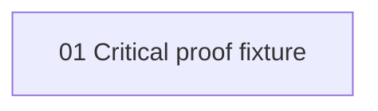

# Phase Plan

## Execution Order

1. Critical proof fixture.

## Phase Sequence

SB01 closes the fixture.

## Subbundle Dependency Map

## Critical Subbundles

- SB01 is critical because it models completed work that downstream phases would trust.

## Phase Gates

- No final closure without semantic adequacy evidence.
