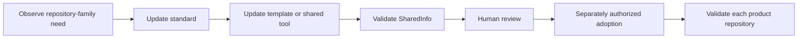

# Shared Information Source Of Truth

## Decision

`CanDoItAll.SharedInfo` owns shared repository conventions, reusable templates,
cross-repository orchestration, and reusable Codex assets. Product repositories own their
source code, local configuration, release logic, and domain-specific automation.

## Ownership Boundaries

| Concern | SharedInfo owns | Product repository owns |
|---|---|---|
| Repository layout | Canonical convention and templates | Adopted layout and exceptions |
| README and policies | Required sections and templates | Product content and contacts |
| Licensing | Family license text, fixed website link, badge, and package-metadata contract | Copyright year and owner, plus documented legal exceptions |
| Git hygiene | Baseline ignore/attributes templates | Deliberate product-specific exceptions |
| .NET defaults | Baseline properties and SDK policy | Target frameworks, versions, package metadata |
| Docker and Compose | Naming, storage, exposure, image, runtime, and validation baseline | Images, service configuration, secrets, data, operations, and recovery |
| NuGet packaging | Entry-point contract and orchestrator | Package selection and build implementation |
| Installation/cloning | Safe cross-repository helpers | Product bootstrap after clone |
| Codex skills | Reusable maintained skill source | Repo-only skills tied to one product |
| Codex plugins | Reusable plugin packaging | MCP/app implementation in its owning repo |
| Task execution | Nothing | Bundles, proof, logs, screenshots, and artifacts |

## Change Flow

No shared change automatically rewrites sibling repositories. Orchestrators may inspect
siblings by default; mutations require an explicit command and should support `-WhatIf`.

## Duplication Policy

Use one of three forms:

1. **Reference:** link to a standard when no local executable file is required.
2. **Template-derived copy:** keep required repository-owned files local and record the
   template version or adoption change.
3. **Shared orchestrator/local adapter:** keep coordination here and product knowledge in
   a stable local entry point.

Do not use filesystem links as the default adoption mechanism. Repositories must remain
buildable and understandable when cloned independently.

## Exceptions

A repository may differ when its runtime, legal constraints, packaging, or security model
requires it. License changes require an explicit owner-approved legal exception. Document
all exceptions beside the local implementation and keep the shared baseline general; do
not weaken the baseline to encode one product's special case.
